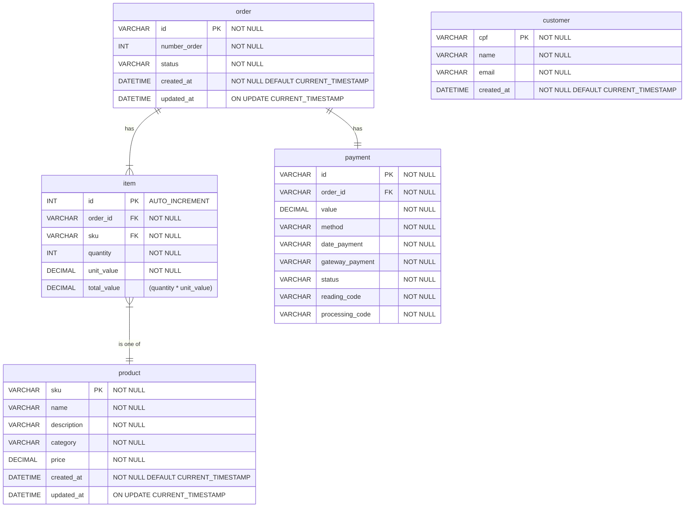

# Sobre a escolha do banco

Nossa escolha sobre manter a utilização do MySQL foi estabelecida devido aos seguintes critérios:

## Esquema na escrita rígido:

Temos maior previsibilidade quanto aos dados que serão armazenados, não precisamos da flexibilidade de esquema provida por um bancos de documentos. Além disso, as restrições de esquema impostas pelo MySQL nos auxiliam a manter maior integridade dos dados.

## Casos de uso:
As leituras e escritas interagem com uma linha de dados por vez, geralmente utilizando todas as colunas, fazendo com que *row-based* seja preferível do que um banco colunar.

Não prevemos disponibilizar acesso direto de usuários para o banco de dados, todas as operações serão transações intermediadas pela camada de serviços. Um OLTP com propriedades ACID é ideal para este cenário.

## Estratégia para escalabilidade

Considerando o fluxo de utilização da aplicação, nossos padrões de acesso tendenciam a um número baixo de escritas e alto para leituras: O pedido é escrito apenas uma vez por compra, enquanto as demais entidades podem ser lidas diversas vezes. Desta forma a adição de réplicas de leitura será efetiva em ampliar escalabilidade.

Outro ponto é que o banco será acessado por regiões fixas (lojas), então esalabilidade horizontal é o suficiente para expansão caso seja necessário reduzir a latência em localizações distantes. Favorecendo a ideia de utilizar réplicas de leitura

Não vemos muito benefício atual na utilização de bancos em memórias para caching. Nossos dados precisam ser armazenados de maneira persistente e o controle que temos nos ambientes físicos das lojas garantem estabilidade de conexão. Dito isso, temos a possibilidade de implementar um banco de cache em conjunto com o MySQL para elevar a performance caso as réplicas de leitura não sejam o suficiente.

## Sumário
Em resumo, optamos pela utilização de um banco MySQL devido a:
- Esquema restritivo para garantir integridade dos dados.
- Padrão de acesso baseado em linhas.
- Padrões de edição baseado em transações, favorecendo um OLTP com propriedades ACID.
- Escalabilidade horizontal através de réplicas de leitura é o suficiente para nossos casos de uso.
- Temos estabilidade de conexão com o banco, não prevemos uso para caches.

# Diagrama de Entidade Relacionamento
