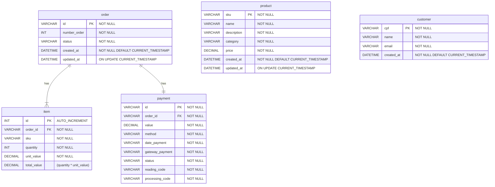

# Sobre a escolha do banco

Nossa escolha sobre manter a utilização do MySQL foi estabelecida devido aos seguintes critérios:

## Esquema na escrita rígido:
- Temos maior previsibilidade quanto aos dados que serão armazenados, não precisamos da flexibilidade de esquema de bancos de documentos.
- Seguindo a mesma linha, as restrições de esquema impostas pelo banco nos auxiliam a manter maior integridade dos dados.

## Padrões de acesso:
- Nossos padrões de acesso favorecem bancos OLTP:
    - As operações serão realizadas em um número baixo de registros, geralmente apenas uma linha por vez.
    - Utilizamos todas as colunas de cada linha lida, não nos beneficiamos de modelos colunares.
    - Os dados serão lidos e escritos por sistemas e não diretamente visíveis para os usuários.
    - Por se tratar de uma aplicação comercial de vendas nos beneficiamos das propriedades ACID nas transações.

## Estratégia para escalabilidade
- O banco será acessado por regiões fixas (lojas), então esalabilidade horizontal é o suficiente para expansão caso seja necessário reduzir a latência em localizações distantes.
- Prevemos maior número de leituras do que escritas: O pedido é escrito apenas uma vez por compra, enquanto as demais entidades podem ser lidas diversas vezes. Desta forma a adição de réplicas de leitura será efetiva em ampliar escalabilidade.
- Não vemos muito benefício na utilização de bancos em memórias para caching. Nossos padrões de acesso são previsíveis e o controle que temos nos ambientes físicos das lojas garantem estabilidade na rede de comunicação.

# Diagrama de Entidade Relacionamento
